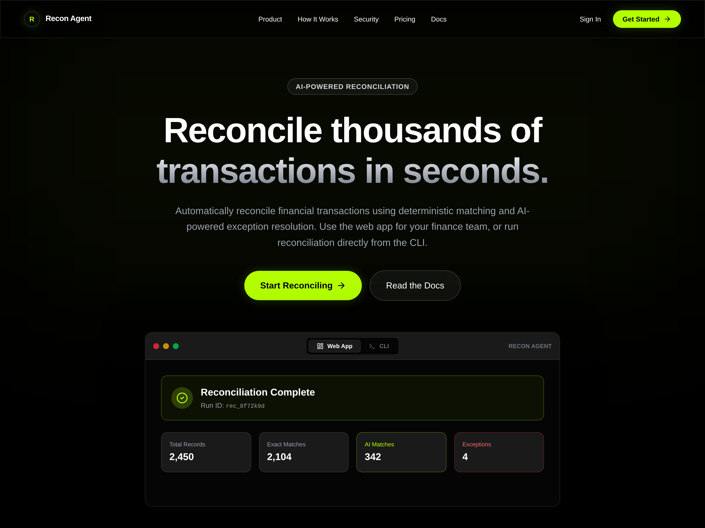

# Recon Agent

[](https://recon-agent-alpha.vercel.app)
[](#-tech-stack)
[](#-testing)

> **Live application:** https://recon-agent-alpha.vercel.app

<div align="center">
  <a href="https://recon-agent-alpha.vercel.app">
    
  </a>
</div>

## Overview

Recon Agent is a multi-tenant financial reconciliation platform that automates the matching of records across source and target transaction datasets.

The system combines a **deterministic reconciliation engine** with fuzzy matching and an isolated AI layer for handling ambiguous cases and generating explanations. Heavy reconciliation work runs asynchronously through a separate worker rather than blocking API requests.

The project was built to demonstrate practical software engineering across **algorithm design, backend architecture, asynchronous processing, database security, testing, API design, and applied AI**.

---

## Key Features

- **High-volume reconciliation** — Deterministic matching pipeline using exact matching, date-window filtering, NumPy vectorization, and Map-Reduce multiprocessing (`ProcessPoolExecutor`) for CPU scalability.
- **Asynchronous processing** — Large reconciliation jobs are pushed to an **Upstash Redis** queue and instantly consumed (`BRPOP`) by a detached Dockerized worker, eliminating HTTP timeouts.
- **Multi-tenant isolation** — PostgreSQL Row-Level Security (RLS) provides database-level tenant isolation, with application-level authorization as defense in depth.
- **AI-assisted resolution** — AI is isolated from the deterministic matching core and used for ambiguous cases and financial exception explanations.
- **Bring Your Own Model (BYOM)** — Supports configurable model providers, including hosted APIs and local Ollama models.
- **CLI + REST API + Web UI** — Reconciliations can be accessed through the web dashboard, Python CLI, or REST API.
- **Secure API-key storage** — User-provided model credentials are encrypted using AES-256-GCM before storage.
- **Reporting** — Generates structured Excel and PDF reconciliation reports.
- **Failure recovery** — Background workers implement database reconnection and exponential backoff.
- **Automated testing** — 63 tests covering core matching behavior, API behavior, authentication, authorization, AI failure cases, and regression scenarios.

---

## Architecture

```text
                    ┌─────────────────────┐
                    │    Next.js Web UI   │
                    │       Vercel        │
                    └──────────┬──────────┘
                               │
                               ▼
                    ┌─────────────────────┐
                    │     FastAPI API     │
                    │       Render        │
                    └──────────┬──────────┘
                               │
                    ┌──────────▼──────────┐
                    │   PostgreSQL /      │
                    │   Supabase Storage  │
                    └──────────┬──────────┘
                               │
                         Job Queue
                               │
                    ┌──────────▼──────────┐
                    │ Background Worker   │
                    │     Python          │
                    └──────────┬──────────┘
                               │
                    ┌──────────▼──────────┐
                    │ Reconciliation Core │
                    │ Pandas / NumPy /    │
                    │ RapidFuzz           │
                    └─────────────────────┘
```

### Processing Flow

1. A user uploads source and target transaction files.
2. The API validates the request and creates a reconciliation job.
3. The API returns without performing the expensive reconciliation work.
4. A background worker claims the queued job using PostgreSQL locking.
5. The worker downloads the input files and executes the reconciliation pipeline.
6. Exact matches are resolved first.
7. Remaining records are filtered using date and amount constraints.
8. NumPy operations reduce the candidate set before expensive fuzzy comparisons.
9. RapidFuzz performs string similarity scoring on the remaining candidates.
10. Ambiguous results can be passed to the AI layer for additional analysis or explanation.
11. Results and generated reports are persisted for the user.

---

## Reconciliation Engine

The core matching engine is designed around **candidate reduction** rather than comparing every source row against every target row.

The pipeline uses:

```text
Exact matching
      ↓
Date-window filtering
      ↓
Binary search / NumPy filtering
      ↓
Amount tolerance filtering
      ↓
RapidFuzz candidate scoring
      ↓
Match / Ambiguous / Unmatched
```

For date filtering, the target dataset is sorted and `numpy.searchsorted` is used to locate relevant date ranges efficiently.

Amount constraints are then applied using vectorized NumPy operations.

Only the remaining candidates are passed to fuzzy string matching.

This substantially reduces unnecessary string comparisons under normal data distributions.

> **Important:** The overall system is not universally O(n log n). The fuzzy matching stage can approach quadratic behavior in pathological cases where numeric filters leave very large candidate sets. The project benchmarks this limitation rather than hiding it.

---

## Performance

The matching engine was benchmarked using synthetic datasets under a heavy fuzzy-matching workload.

|      Dataset | Processing Time | Memory Increase |
| -----------: | --------------: | --------------: |
|   1,000 rows |         ~0.27 s |           ~4 MB |
|   5,000 rows |         ~1.56 s |           ~3 MB |
|  10,000 rows |         ~3.66 s |           ~5 MB |
|  50,000 rows |           ~42 s |          ~30 MB |
| 100,000 rows |          ~170 s |          ~57 MB |

The benchmark demonstrates that the deterministic filtering strategy keeps memory usage relatively low, while also exposing the primary scaling bottleneck: fuzzy candidate comparisons.

Because reconciliation can take tens of seconds or minutes at larger scales, the system processes these workloads asynchronously instead of blocking API requests.

Detailed methodology and results are available in [`docs/benchmark_results.md`](docs/benchmark_results.md).

---

## Security & Multi-Tenancy

Recon Agent uses multiple layers of protection for tenant data:

### PostgreSQL Row-Level Security

Database tables use PostgreSQL RLS policies to enforce organization-level data isolation.

Application-level organization checks provide an additional authorization layer rather than relying solely on application queries.

### Authentication

Authentication and organization management are handled through Clerk.

### API Credentials

User-provided model API keys are encrypted using AES-256-GCM before being persisted.

### API Security

The API validates authentication credentials and restricts cross-tenant access.

Security and authorization behavior is covered by automated tests.

---

## AI Architecture

AI is intentionally **not responsible for the primary reconciliation logic**.

The deterministic engine handles the high-confidence portion of reconciliation first.

AI is isolated as a secondary layer for cases where contextual interpretation or explanation is useful.

This design provides:

* Deterministic behavior for financial matching
* Reduced LLM usage
* Lower exposure of financial data to external models
* Explicit handling of ambiguous cases
* Graceful behavior when an AI provider fails
* Structured AI responses rather than unrestricted prose

The system can work with hosted model providers or local Ollama models.

---

## Interfaces

### Web Application

The Next.js dashboard provides:

* Authentication
* Organization/workspace management
* File uploads
* Reconciliation runs
* Match statistics
* Exception information
* Historical runs
* Reports
* AI explanations

### REST API

The FastAPI backend exposes the application functionality programmatically.

### CLI

Recon Agent also provides a Python CLI:

```bash
recon login
recon reconcile source.csv target.csv
recon history
recon explain <run_id>
```

This allows the reconciliation engine to be used without the web interface.

---

## Tech Stack

### Frontend

* Next.js 16
* React
* TailwindCSS
* Framer Motion
* Recharts

### Backend

* Python
* FastAPI
* Uvicorn
* Pandas
* NumPy
* RapidFuzz

### Database & Storage

* PostgreSQL
* Supabase
* PostgreSQL Row-Level Security
* Supabase Storage

### Authentication

* Clerk

### AI

* OpenAI
* Google Gemini
* Groq
* Ollama (Local)
* Structured model responses

### CLI

* Typer
* Rich

### Testing

* pytest
* pytest-asyncio
* respx

### Deployment

* Vercel — frontend
* Render — API / worker
* Supabase — database and storage

---

## Testing

The repository contains **63 passing tests**.

Testing covers:

* Core reconciliation behavior
* Exact matching
* Date-window filtering
* Amount tolerance
* Fuzzy matching regression behavior
* API behavior
* Authentication
* Cross-tenant authorization
* RLS-related access boundaries
* AI failure scenarios
* CLI behavior
* Report generation

A brute-force reference matcher is also used to compare the optimized matching engine against a simpler implementation and detect behavioral regressions.

Run the test suite with:

```bash
uv run pytest
```

---

## Local Development

### Prerequisites

* Python 3.12+
* Node.js
* `uv`
* Supabase project
* Clerk application

### Backend

```bash
uv sync

uv run uvicorn api.main:app \
  --host 0.0.0.0 \
  --port 8000 \
  --reload
```

Health check:

```bash
curl http://localhost:8000/health
```

### Worker

Run the background worker separately:

```bash
uv run python worker.py
```

### Frontend

```bash
cd web
npm install
npm run dev
```

---

## CLI Installation

Install the project locally:

```bash
pip install -e .
```

or:

```bash
uv pip install -e .
```

Then:

```bash
recon login
recon reconcile source.csv target.csv
recon history
recon explain <run_id>
```

---

## Environment Variables

Create the required environment configuration according to your deployment setup.

Example backend configuration:

```env
SUPABASE_URL=https://<project-ref>.supabase.co
SUPABASE_SERVICE_KEY=<service_role_key>
CLERK_SECRET_KEY=sk_test_...
CLERK_ISSUER=https://<your-app>.clerk.accounts.dev
ENCRYPTION_KEY=<base64_32_byte_key>
```

Frontend:

```env
NEXT_PUBLIC_CLERK_PUBLISHABLE_KEY=pk_test_...
```

Never commit real credentials or API keys.

---

## Deployment

The current application is deployed using:

```text
Next.js
   ↓
Vercel

FastAPI API
   ↓
Render

Background Worker
   ↓
Render

PostgreSQL + Storage
   ↓
Supabase
```

The application is deployed and publicly accessible through the live demo.

The current deployment uses managed/free-tier infrastructure and therefore has limitations such as cold starts and resource constraints. A production deployment at significantly higher workloads would require dedicated compute and a more robust job-broker architecture.

---

## Known Engineering Limitations

The project intentionally documents its current limitations rather than presenting the MVP as an unlimited production system.

### Fuzzy Matching Bottleneck

The expensive fuzzy-matching stage can become the dominant cost when numeric filters produce very large candidate sets.

### Database-Polling Worker

The current worker uses PostgreSQL job polling with:

```sql
FOR UPDATE SKIP LOCKED
```

This provides safe job claiming across workers, but a dedicated message broker would be more appropriate for substantially larger workloads.

### Free-Tier Deployment

The public deployment runs on managed/free-tier infrastructure and is subject to provider resource and cold-start limitations.

These limitations are documented so that the architecture can be evaluated realistically.

---

## Future Engineering Work

Potential future improvements include:

* Dedicated message broker for job processing
* More advanced candidate indexing
* Improved fuzzy-match scalability
* Configurable reconciliation rules
* Human-in-the-loop reconciliation workflows
* More comprehensive observability
* Production-grade infrastructure and autoscaling

---

## Documentation

Additional engineering documentation:

* [Architecture](docs/architecture.md)
* [Benchmark Results](docs/benchmark_results.md)
* [Demo Script](docs/demo_script.md)
* [Engineering Report](engineering_report.md)
* [Platform Integration Audit](docs/platform-integration-audit.md)
* [Phase 2: Platform Foundations](docs/phase-2-foundations-report.md)
* [Phase 3: API Authentication](docs/api-authentication.md)
* [Phase 4: CLI Documentation](docs/cli.md)
* [Phase 5: Tiers and Roles](docs/tiers-and-roles.md)

---

## License

See the repository license for usage and distribution terms.
